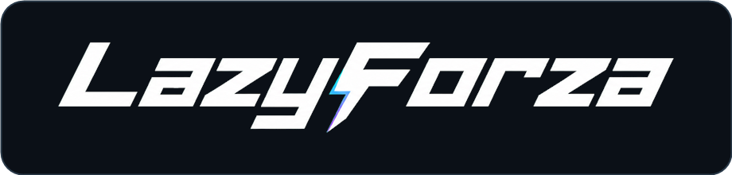

<p align="center">
  
</p>

<p align="center">Forza Horizon 6 的本地遥测、驾驶分析与地产赛事工具</p>

<p align="center">
  <a href="https://laz22y.github.io/LazyForza/">官网</a> ·
  <a href="https://laz22y.github.io/LazyForza/docs/">完整文档</a> ·
  <a href="https://github.com/Laz22y/LazyForza/releases/latest">下载</a> ·
  <a href="https://github.com/Laz22y/LazyForza.RaceServer">RaceServer</a>
</p>

LazyForza 通过 FH6 官方 UDP Data Out 获取数据，不读取游戏内存、不注入 DLL、不修改游戏进程。设置、圈速、车辆学习和录制默认保存在本机。

## 功能

| 模块 | 能力 |
| --- | --- |
| 实时 HUD | 速度、挡位、转速、踏板、方向、轮胎、动力和换挡提示；部件可独立移动、缩放和调节透明度 |
| 圈速分析 | 分段、实时 Delta、速度与驾驶输入、走线和距离游标联动 |
| 车辆学习 | 按车型、性能等级和可观测调校特征学习换挡目标，离线识别车辆名称 |
| 录制与回放 | 可选自动录制、容量保护、`.lfztelemetry` 导入导出和联动回放 |
| 地产赛事 | 地产环道、维修区、赛事 HUD，并可连接独立 RaceServer 参加练习、排位和正赛 |
| 数据与更新 | 本地数据库、备份、诊断；GitCode/GitHub 更新回退及双层完整性校验 |

实验性漂移 HUD 默认关闭。它只根据本车 UDP 推导侧滑和控车趋势，不复刻游戏评分，也不代替玩家判断。

## 快速开始

1. 从 [Releases](https://github.com/Laz22y/LazyForza/releases/latest) 下载最新版 `win-x64.zip`，完整解压；
2. 运行 `LazyForza.App.exe`；
3. 在 FH6“设置 > HUD 与游戏玩法”中开启 Data Out；
4. 地址填写 `127.0.0.1`，端口填写 `2299`。

正式包已包含 .NET 运行时。默认数据目录为 `%LOCALAPPDATA%\LazyForza`。需要隔离数据时可使用：

```powershell
LazyForza.App.exe --data-dir "D:\LazyForza_Data"
```

完整的安装、功能、数据、故障排查和开发说明见 [LazyForza 文档](https://laz22y.github.io/LazyForza/docs/)。

## RaceServer

[LazyForza.RaceServer](https://github.com/Laz22y/LazyForza.RaceServer) 是独立的地产赛事服务端，提供：

- 1–12 名车手和额外 OB 席位；
- 练习、多节排位、正赛、旗语、处罚和调查；
- 维修区、车队、赛道文件托管与阶段赛果归档；
- Windows、Linux、macOS 自托管包和 Cloudflare Durable Objects 版本。

只使用实时 HUD 和圈速分析时不需要部署服务端。部署前阅读[赛事服务端指引](https://laz22y.github.io/LazyForza/docs/#race-server)。

## 本地构建

需要 Windows 10/11 x64、.NET SDK 9 和 PowerShell 7：

```powershell
dotnet restore LazyForza.sln --configfile NuGet.Config
dotnet build LazyForza.sln --no-restore -c Debug
dotnet test LazyForza.sln --no-build --no-restore -c Debug
dotnet run --project src/LazyForza.App/LazyForza.App.csproj --no-build --no-restore -c Debug
```

模拟与回放：

```powershell
dotnet run --project src/LazyForza.App/LazyForza.App.csproj -- --demo
dotnet run --project src/LazyForza.App/LazyForza.App.csproj -- --replay "C:\path\session.lfztelemetry"
```

## 开发资料

- [完整用户与开发者文档](docs/LazyForza-Documentation.md)
- [架构](ARCHITECTURE.md)
- [FH6 遥测开发参考](FH6_TELEMETRY_DEVELOPMENT_GUIDE.md)

FH6 UDP 不提供官方赛事 ID、对手遥测或调校 ID。推导数据会与官方字段明确区分。

## 致谢

感谢 [HDR 维护并提供 FH6 Car Ordinals 车辆标识符文档](https://gist.github.com/HDR/0659d1717bc61504bf83750628963f4f)。LazyForza 使用其内置快照完成离线车辆名称映射。

## License

[MIT](LICENSE)。LazyForza 是非官方社区项目，与 Microsoft、Xbox 或 Playground Games 无隶属关系；相关商标属于其各自权利人。
