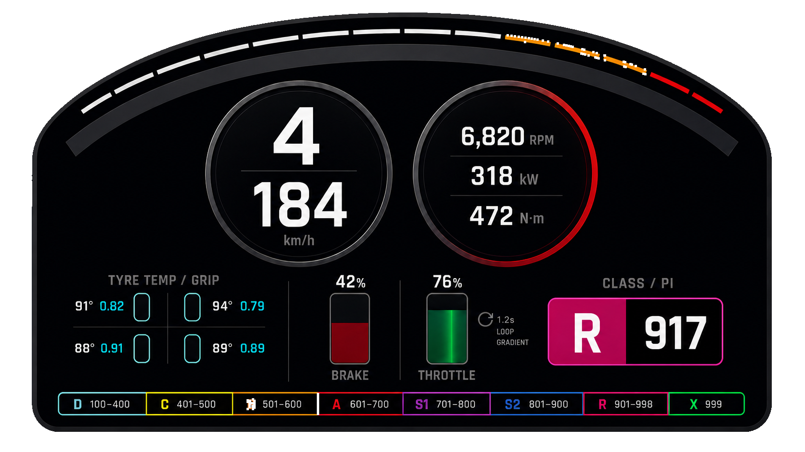

# FH6 极简遥测仪表盘 V2 复刻规格

> **Status: Historical visual reference**
> 本文解释初始 Dashboard 视觉来源，不是当前 UI 实施规范。修改现有 HUD 时以 `LazyForza.Overlay`、布局持久化模型、相关测试和实际 Windows 画面为准；开发入口见 [`../AGENTS.md`](../AGENTS.md)。



## 1. 目标与交付形态

这是一张供开发 Agent 复刻的视觉基准，不是 Forza 官方界面。推荐实现为透明悬浮窗或游戏画面上的 HUD Overlay：画布背景透明，只有深色仪表盘本体不透明或轻微半透明。

- 设计稿尺寸：`1672 × 941`，RGBA PNG。
- 画布外部：`alpha = 0`。
- 仪表盘本体：近黑色高级哑光面板，主体保持高不透明度以保证游戏画面上可读。
- 推荐按归一化坐标布局，避免把像素尺寸写死。
- 风格关键词：极简、精密、高级、克制、无拟物纹理、无多余霓虹。

## 2. 信息层级与布局

仪表盘被一条宽而舒展的拱形弧线分隔。弧线上方是一条与之等距、平行的细分段 RPM 弧；弧线下方是所有主要数据。

中间必须使用两个等尺寸圆形模块并排放置，消除上一版过多的垂直留白：

```text
                         分段 RPM / 红区细弧
                    ─────── 宽主分隔弧 ───────

                   [ 挡位 / 时速 ] [ RPM / kW / N·m ]

    [四轮温度/抓地]      [刹车] [油门+循环渐变]      [车辆等级 / PI]

               [D] [C] [B] [A] [S1] [S2] [R] [X]
```

建议区域：

| 区域 | 归一化范围/中心 |
|---|---|
| RPM 细弧 | `x: 0.09..0.91, y: 0.05..0.25` |
| 宽主弧 | `x: 0.06..0.94, y: 0.09..0.35` |
| 挡位/时速圆 | 中心约 `(0.37, 0.38)` |
| 动力数据圆 | 中心约 `(0.63, 0.38)` |
| 轮胎区 | 中心约 `(0.20, 0.72)` |
| 刹车/油门 | 中心约 `(0.50, 0.73)` |
| 等级/PI | 中心约 `(0.80, 0.72)` |
| 全等级色条 | `x: 0.07..0.93, y: 0.87..0.93` |

## 3. 顶部 RPM 弧

- 宽主弧只承担结构分隔，颜色建议 `#20252D`，不要让它表现数值。
- 细弧由 `14–18` 个等长短段组成，并与宽主弧严格平行。
- 进度：`rpmRatio = clamp(CurrentEngineRpm / EngineMaxRpm, 0, 1)`。
- 未到达段为低亮灰，已到达段为米白；接近限制区过渡为琥珀色，最右侧红区为红色。
- 红区起点应来自车辆配置或实测，不要硬编码绝对 RPM。

## 4. 两个并排圆形模块

### 4.1 左圆：挡位与时速

- 视觉权重最高的是当前挡位 `Gear`，示例为 `4`。
- 圆内中部用一条很细的水平分隔线。
- 时速来自 `Speed`，官方单位为 m/s；公制显示：`round(Speed × 3.6)`，示例为 `184 km/h`。
- 特殊挡位（空挡、倒挡）的数值映射必须通过 FH6 实测确认。

### 4.2 右圆：发动机状态

从上到下显示：

- `CurrentEngineRpm`：示例 `6,820 RPM`；
- `Power / 1000`：示例 `318 kW`；
- `Torque`：示例 `472 N·m`。

圆环随 RPM 连续向红色过渡，不能突然闪烁：

| RPM 比例 | 圆环状态 |
|---:|---|
| `< 0.75` | 石墨灰/银灰 |
| `0.75..0.90` | 暗红逐渐混入 |
| `0.90..1.00` | 明显深红到亮红，接近限制器时提高亮度 |

建议对显示 RPM 做 `80–150 ms` 轻度平滑，但换挡提示逻辑使用低延迟原始值。

## 5. 刹车与油门

- 左侧矩形永远表示刹车 `Brake`；右侧矩形永远表示油门 `Accel`。
- 原始范围均为 `0..255`，百分比：`round(raw / 255 × 100)`。
- 填充从底部向上增长；百分比位于矩形上方，标签位于下方。
- 刹车深红：`#8B1E2D`，高亮可用 `#B3263B`。
- 油门深绿：`#0B6B43`，高亮可用 `#18A765`。
- 示例：刹车 `42%`，油门 `76%`。

### 5.1 油门循环动力渐变

油门填充内部增加一条很窄、较亮的纵向/斜向能量带，沿填充区循环移动。它只表达动力正在输出，不改变油门百分比的几何高度。设计稿旁的 `1.2s LOOP GRADIENT` 是实现说明，正式用户界面可隐藏此文字。

```css
.throttle-fill {
  height: calc(var(--throttle) * 100%);
  background:
    linear-gradient(90deg,
      #073d2a 0%, #0b6b43 38%, #18a765 50%,
      #0b6b43 62%, #073d2a 100%);
  background-size: 220% 100%;
  animation: throttle-flow 1.2s linear infinite;
}

@keyframes throttle-flow {
  from { background-position: 120% 0; }
  to   { background-position: -120% 0; }
}
```

实现建议：

- `Accel = 0` 时暂停动画并降低填充亮度。
- 可让周期由油门深度映射为约 `1.6s → 0.65s`，但不要快到闪烁。
- 动画必须裁剪在油门填充矩形内。
- 遵守系统的 `prefers-reduced-motion`；减少动态时改为静态深绿渐变。

## 6. 极简轮胎温度/抓地可视化

轮胎区使用四个纯轮廓圆角胶囊，不使用轮胎图片、斑纹、胎纹或车辆俯视图：

```text
FL capsule   FR capsule
RL capsule   RR capsule
```

- 每个轮胎旁同时显示温度与抓地指标。
- 温度来自 `TireTempFL/FR/RL/RR`；官方文档未标明单位，正式标注 `°C/°F` 前必须实测。
- 抓地 UI 指标可由 `TireCombinedSlip*` 映射：`grip = clamp(1 - abs(slip), 0, 1)`。
- 该 `grip` 是产品层直观指标，不是游戏直接输出的物理抓地系数。
- 健康状态使用低饱和青色 `#20B8CF`；接近失去抓地时再渐变为琥珀/红色。
- 示例读数：`91° 0.82`、`94° 0.79`、`88° 0.91`、`89° 0.89`。

## 7. FH6 车辆等级、PI 范围与颜色

当前车辆徽章采用左右双段：左段显示等级，右段显示三位 PI。设计稿示例为 `R | 917`。颜色值是根据当前 FH6 界面视觉近似得到的 UI token，不是官方发布的精确色值。

| 等级 | PI 范围 | 建议颜色 | 视觉描述 |
|---|---:|---|---|
| D | `100–400` | `#62B8E8` | 浅青蓝 |
| C | `401–500` | `#F2B827` | 金黄 |
| B | `501–600` | `#ED7A1A` | 橙色 |
| A | `601–700` | `#E3314F` | 红色 |
| S1 | `701–800` | `#B43BDD` | 紫色 |
| S2 | `801–900` | `#2472D4` | 蓝色 |
| R | `901–998` | `#E62A83` | 洋红/玫红 |
| X | `999` | `#00B85A` | 翡翠绿 |

数据绑定使用 `CarClass` 与 `CarPerformanceIndex`。等级底色与文字需要满足对比度；在亮色等级块上可改用深色 PI 文字。不要添加 Forza/Xbox 商标，也不要套用旧作的单色等级牌。

## 8. 透明背景实现

可以实现真正的透明背景。当前 `FH6_TELEMETRY_DASHBOARD_DESIGN_V2_TRANSPARENT.png` 已含 alpha 通道，画布四角与仪表盘外部为透明。

实现时区分两层：

1. 应用窗口/根画布：完全透明；
2. 仪表盘本体：近黑 `#090B0E`，建议 `0.92–0.98` 不透明度，外轮廓使用中性石墨灰。

如果做 Windows 游戏覆盖层，还应根据产品需求分别实现置顶、无边框、鼠标穿透和可关闭的点击交互模式；透明并不等于整窗不可交互。

## 9. 高级感约束

- 只保留一套金属层级：近黑面板、石墨细边、极少银灰高光。
- 不使用碳纤维、胎纹、玻璃反射图片或大面积发光。
- 高亮只出现在 RPM 红区、油门能量带和当前车辆等级。
- 字体优先窄体几何无衬线；数字使用 tabular numerals，避免实时宽度跳动。
- 所有描边使用一致的粗细体系，例如 `1 / 2 / 4 px` 三档。
- 颜色只用于传达状态，不把装饰色扩散到大面积背景。

## 10. Agent 落地检查清单

- [ ] 两个主要圆形读数并排，而不是上下堆叠。
- [ ] 挡位/时速在左，RPM/kW/N·m 在右。
- [ ] 宽主弧与细 RPM 弧严格平行。
- [ ] 刹车永远在左，油门永远在右。
- [ ] 刹车使用深红，油门使用深绿。
- [ ] 油门渐变只在填充区内循环，且支持减少动态。
- [ ] 轮胎只用四个极简胶囊，不出现胎纹图片。
- [ ] D、C、B、A、S1、S2、R、X 的范围与颜色完整展示。
- [ ] 当前等级/PI 使用双段徽章，示例为 `R | 917`。
- [ ] 根背景支持真正 alpha 透明，不用黑色矩形假装透明。
- [ ] 所有数据均绑定 FH6 Data Out 字段；温度单位和特殊挡位仍标记为待实测。

## 11. 参考来源

- [Forza Horizon 6 “Data Out” Documentation](https://support.forza.net/hc/en-us/articles/51744149102611-Forza-Horizon-6-Data-Out-Documentation)：字段、单位、范围与数据发送行为。
- [Forza Horizon 6 官方车辆列表](https://forza.net/fh6cars?pubDate=20260124)：当前车辆的等级/PI 实例，包括 R 级车辆。
- [FH6 class range breakdown](https://forzahorizonhub.com/guides/forza-horizon-6-best-cars-by-class)：D 到 R 的当前 PI 分段参考；该站为社区站点，不是官方开发者资料。

等级色的十六进制值属于从当前游戏界面近似提取的实现建议，应集中定义为主题 token，便于后续按真实截图继续校色。
